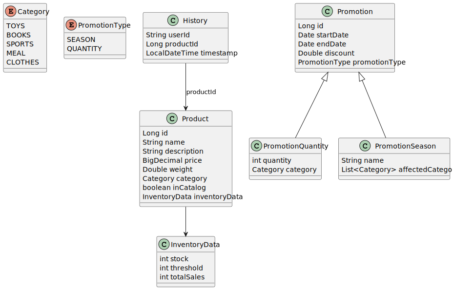

# 🛍️ PRODUCT API Endpoints

RESTful API built with Spring Boot for managing products, promotions (seasonal and quantity-based), and inventory.  
Designed following a layered architecture (`integration`, `business`, `presentation`).  
Forms part of a modular e-commerce system.

## 🌐 Base URL

https://workshop-7uvd.onrender.com/api/v1

## 📦 Endpoints Overview

### - Products

| Method | Endpoint                    | Description                            |
|--------|-----------------------------|----------------------------------------|
| GET    | `/products`                 | Get all products                       |
| POST   | `/products`                 | Create a new product                   |
| GET    | `/products/{id}`            | Get product by ID                      |
| PUT    | `/products/{id}`            | Update product by ID                   |
| DELETE | `/products/{id}`            | Delete product by ID                   |
| PATCH  | `/products/{id}`            | Update stock for a product             |
| POST   | `/products/list-by-ids`     | Get list of products by their IDs      |

### - Promotions (Season-Based)

| Method | Endpoint                           | Description                                 |
|--------|------------------------------------|---------------------------------------------|
| GET    | `/promotionsSeason`                | Get all season-based promotions             |
| POST   | `/promotionsSeason`                | Create a season-based promotion             |
| GET    | `/promotionsSeason/{id}`           | Get season promotion by ID                  |
| PUT    | `/promotionsSeason/{id}`           | Update season promotion by ID               |
| DELETE | `/promotionsSeason/{id}`           | Delete season promotion by ID               |
| POST   | `/promotionsSeason/get-by-category`| Get active season promotions by category    |

### - Promotions (Quantity-Based)

| Method | Endpoint                             | Description                                   |
|--------|--------------------------------------|-----------------------------------------------|
| GET    | `/promotionsQuantity`                | Get all quantity-based promotions             |
| POST   | `/promotionsQuantity`                | Create a quantity-based promotion             |
| GET    | `/promotionsQuantity/{id}`           | Get quantity promotion by ID                  |
| PUT    | `/promotionsQuantity/{id}`           | Update quantity promotion by ID               |
| DELETE | `/promotionsQuantity/{id}`           | Delete quantity promotion by ID               |
| POST   | `/promotionsQuantity/get-by-category`| Get active quantity promotions by category    |

### - General Promotions

| Method | Endpoint                        | Description                         |
|--------|---------------------------------|-------------------------------------|
| GET    | `/promotions`                   | Get all promotions (any type)       |
| POST   | `/promotions/get-by-category`   | Get promotions by category          |

### - Recommendations

| Method | Endpoint                    | Description                                 |
|--------|-----------------------------|---------------------------------------------|
| GET    | `/recommendations/{userId}` | Get personalized product recommendations    |

---

## · InventoryData (inside Product)

Each product has the following inventory fields:

| Campo        | Tipo   | Descripción                    |
|--------------|--------|--------------------------------|
| `stock`      | int32  | Available units                |
| `threshold`  | int32  | Limit to trigger restock event |
| `totalSales` | int32  | Total units sold               |

---

## · Enum: Product Category

The possible values for the `category` field are:

- `TOYS`
- `BOOKS`
- `SPORTS`
- `MEAL`
- `CLOTHES`

---

## · Enum: Promotion Type

The possible values for the `promotionType` field are:

- `SEASON`
- `QUANTITY`

---

## 🗄️ Database diagram

---

## 📦 Classes Diagram

